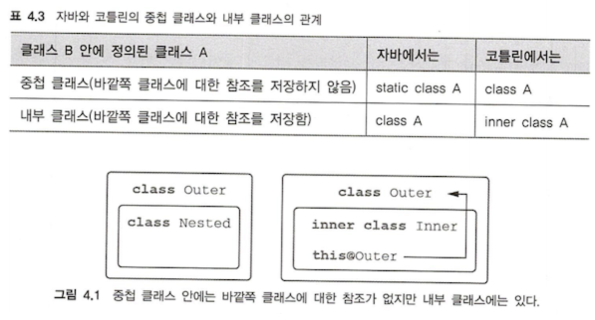
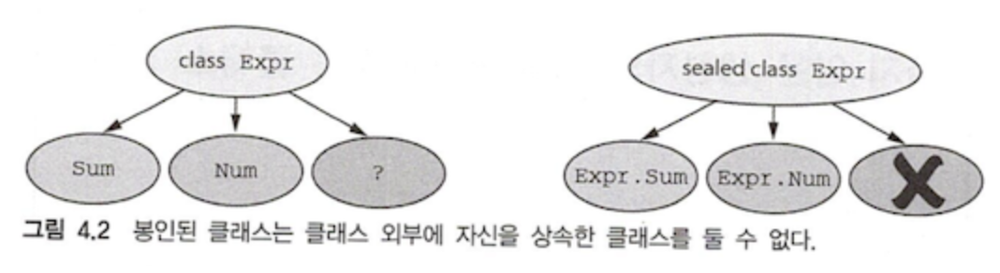

# Chapter 4. 클래스, 객체, 인터페이스

> 코틀린의 클래스와 인터페이스는 자바의 것과 약간 다르다!

- 인터페이스에 프로퍼티 선언이 들어갈 수 있다
- 기본적으로 final이며 public이다
- 중첩 클래스에는 외부 클래스에 대한 참조가 없다
- 위임을 이용해 준비 메서드 작성을 생략할 수 있다

## 4.1 클래스 계층 정의

### 📌 코틀린 인터페이스

> 인터페이스 안에는 추상 메서드 뿐 아니라 구현이 있는 메서드를 정의할 수 있다.
> 단, 아무런 상태 (필드)도 들어갈 수 없다. 

```kotlin
// 추상 메서드가 있는 인터페이스 예시
interface Clickable {
    // 일반 메서드
    fun click()
    // 디폴트 구현이 있는 메서드
    fun showOff() = println("I'm clickable!")
}

class Button : Clickable {
    override fun click() = println("I was clicked")
}

fun main(args: Array<String>) {
    Button().click()
}
```

- 클래스 이름 뒤에 `콜론 (:)`을 붙이는 것만으로 클래스 확장과 인터페이스 구현을 모두 처리할 수 있다.
- 인터페이스는 개수 제한 없이 구현할 수 있으나, 클래스는 하나만 확장 가능하다. (자바와 동일)
- 자바와 달리 `override` 변경자를 필수로 사용해야 한다.
- 인터페이스에서 디폴트 구현이 있는 메소드를 구현할 때 `default` 키워드를 생략할 수 있다.
- 동일한 이름의 디폴트 메소드를 가진 서로 다른 두 인터페이스를 하나의 클래스에서 구현한다면?
  - 컴파일러 오류가 발생한다. 상위 인터페이스들에 있는 디폴트 메소드 구현을 대체할 오버라이딩 메서드가 필요하다.

```kotlin
class Button : Clickable, Focusable {
    override fun click() = println("I was clicked")
    // 이름과 시그니처가 같은 멤버 메서드에 둘 이상의 디폴트 구현이 있다면 => 하위 클래스에서 명시적으로 새롭게 구현
    override fun showOff() {
        // 상위 타입의 이름을 `<>`에 넣어서 super로 지정할 수 있다.
        super<Clickable>.showOff()
        super<Focusable>.showOff()
    }
}

interface Clickable {
    fun click()
    fun showOff() = println("I'm clickable!")
}

interface Focusable {
    fun setFocus(b: Boolean) =
        println("I ${if (b) "got" else "lost"} focus.")
    fun showOff() = println("I'm focusable!")
}

fun main(args: Array<String>) {
    val button = Button()
    button.showOff()        // I'm clickable! I'm focusable! 
    button.setFocus(true)   // I got focus
    button.click()          // I was clicked
}
```

- 코틀린은 자바 6과 호환되게 설계되었다 : 인터페이스와 디폴트 메서드를 지원하는게 아니다.
  - 일반 인터페이스와 디폴트 메서드 구현이 정적 메서드로 들어있는 클래스를 조합하여 구현!

<br>

### 📌 open, final, abstract 변경자 : 기본적으로 final

> 명시적으로 final을 사용하지 않는 한 모든 클래스가 다른 클래스를 상속할 수 있는 자바와 다르게, 코틀린은 기본적으로 final이다.

- 취약한 기반 클래스 (fragile base class)
  - 하위 클래스가 기반 클래스에 대해 가진 가정이 깨지는 경우 
  - 기반 클래스 작성자 의도와 다른 방식으로 오버라이드하거나, 기반 클래스가 갑자기 바뀌어 하위 클래스가 변경되거나

```kotlin
// 다른 클래스는 이 클래스를 상속할 수 있다
open class RichButton : Clickable {
    // 하위 클래스는 이 클래스를 오버라이드 할 수 없다
    fun disable() {}
    // 하위 클래스에서 오버라이드 할 수 있다
    open fun animate() {}
    // 상위 클래스의 open 된 메서드를 오버라이드 한 경우. 기본적으로 open 되어 있다
    override fun click() {} 
}
```

- 코틀린의 클래스와 메서드는 기본적으로 `final` 이며 `public`
- 클래스 상속을 허용하고 싶다면 클래스 앞에 `open` 키워드 필요
- 오버라이드를 허용하고 싶은 메서드, 프로퍼티 앞에도 `open` 필요
- 상위 클래스의 open 된 메서드를 오버라이드 한 경우 기본적으로 open. 막고 싶으면 `final` 사용

```kotlin
// 인스턴스를 만들 수 없는 추상 클래스
abstract class Animated {
    // 구현이 없는 추상 함수. 하위 클래스는 반드시 오버라이드 해야 한다
    abstract fun animate()
    // 추상 클래스에 속한 비추상 함수. 디폴트는 final 이지만 open으로 오버라이드 허용 가능
    open fun stopAnimating() {
        
    }
    fun animateTwice() {
        
    }
}
```

- abstract로 추상 클래스를 만들 수 있다
- 구현이 없는 추상 멤버가 있어, 기본적으로 하위 클래스에서 오버라이드가 필요하다. 
  - 따라서 항상 열려있다. open 필요 없음
- 단 비추상 멤버는 디폴트 final. 오버라이드를 허용할거라면 open 키워드가 필요하다. 

|   변경자    |          이 변경자가 붙은 멤버는          |                             설명                             |
|:--------:|:-------------------------------:|:----------------------------------------------------------:|
|  final   |          오버라이드 할 수 없음           |                       클래스 멤버의 기본 변경자                       |
|   open   |          오버라이드 할 수 있음           |                  반드시 open을 명시해야 오버라이드 가능                   |
| abstract |          반드시 오버라이드 필요           |        추상 클래스의 멤버에만 사용 가능. <br> 추상 멤버에게는 구현이 있으면 안됨        |
| override | 상위 클래스나 상위 인스턴스의 멤버를 오버라이드 하는 중 | 오버라이드하는 멤버는 기본적으로 Open. <br> 하위 클래스의 오버라이드를 금지하려면 final 필요 |


### 📌 가시성 변경자 : 기본적으로 공개

- 코드 기반에 있는 선언에 대한 클래스 외부 접근을 제어한다
- 클래스 구현에 대한 접근을 제어 -> 이에 의존하는 외부 코드를 깨지 않고도 내부 구현 변경 가능!
- 아무 변경자도 없다면 모든 선언은 `Public`
  - 자바의 default인 패키지 전용은 코틀린에 없다. 애초에 패키지를 네임 스페이스 관리 용으로만 사용하기 때문
  - 대신 `internal`을 사용해 모듈 내부에서만 사용 가능하게 만들 수 있다.

|     변경자     |       클래스 멤버       |      최상위 선언       |
|:-----------:|:------------------:|:-----------------:|
| public (기본) |   모든 곳에서 볼 수 있다    |   모든 곳에서 볼 수 있다   |
|  internal   | 같은 모듈 안에서만 볼 수 있다  | 같은 모듈 안에서만 볼 수 있다 |
|  protected  | 하위 클래스 안에서만 볼 수 있다 |  최상위 선언에 적용 불가능   |
|   private   | 같은 클래스 안에서만 볼 수 있다 | 같은 파일 안에서만 볼 수 있다 |

> 코틀린의 가시성 변경자 처리 방법 <br>
> - 코틀린의 가시성 변경자는 컴파일 된 후 자바 바이트 코드에서도 동일하게 유지된다. <br>
> - 단, private의 경우 패키지-전용 클래스로 컴파일한다. <br>
> - internal의 경우 바이트 코드 상에서는 public으로 전환된다. 

### 📌 내부 클래스와 중첩된 클래스 : 기본적으로 중첩 클래스

- 코틀린의 중첩 클래스는 명시적으로 요청하지 않는 한 바깥 클래스 인스턴스에 대해 접근 권한이 없다
  - 자바는 다른 클래스 안에 새로운 클래스를 정의하면 자동으로 inner class가 된다
- 내부에서 외부에 접근하기 위해 `inner` 키워드를 붙여야 한다.
  - 외부 클래스 참조에 접근할 땐 `this@{외부클래스이름)`을 사용한다.

```kotlin
class Outer {
    // 내부 클래스 Inner가 외부 클래스 Outer에 접근하기 위해 inner 키워드를 붙였다.
    inner class Inner {
        // 외부 클래스 Outer의 참조에 접근하기 위해 this@를 이용했다.
        fun getOuterReference(): Outer = this@Outer
    }
}
```




### 📌 봉인된 클래스 : 클래스 계층 정의 시 계층 확장 제안

- 코틀린 컴파일러는 when을 이용해 Expr 타입의 값을 검사할 때 꼭 디폴트 분기인 else를 강제한다.
  - 만약 Else에서 던질 만한 값이 없다면 예외를 던져야 한다. 
  - 편하지도 않고, 새로운 클래스가 추가되었을 때 분기 처리를 잊게 될 수 있어 위험하다.
- `sealed` 변경자를 이용해 하위 클래스를 상위 클래스에 중첩시켜 정의를 제한할 수 있다.
  - `sealed`로 표시된 클래스는 자동으로 `open`이다.

```kotlin
// 기반 클래스를 sealed로 봉인 & 하위 클래스를 중첩 클래스로 나열
sealed class Expr {
    class Num(val value: Int) : Expr()
    class Sum(val left: Expr, val right: Expr) : Expr()
}
// when 식이 모든 하위 클래스를 검사함 = 별도의 else 분기 필요 없다
fun eval(e: Expr): Int =
    when (e) {
        is Expr.Num -> e.value
        is Expr.Sum -> eval(e.right) + eval(e.left)
    }

fun main(args: Array<String>) {
    println(eval(Expr.Sum(Expr.Sum(Expr.Num(1), Expr.Num(2)), Expr.Num(4))))
}
```



> 코틀린 1.5부터는 sealed 클래스가 정의된 패키지 안의 아무 위치에나 중첩 클래스를 만들 수 있다.

<br>

## 4.2 뻔하지 않은 생성자와 프로퍼티를 갖는 클래스 선언

- 코틀린은 주 생성자와 부 생성자를 구분한다.
  - 주 생성자 : 주로 클래스 초기화할 때 사용하는 간략한 생성자. 클래스 본문 밖에서 정의
    - 생성자 파라미터 지정
    - 생성자 파라미터에 의해 초기화되는 프로퍼티 정의
  - 부 생성자 : 클래스 본문 안에서 정의
- 코틀린은 초기화 블록을 통해 초기화 로직을 추가할 수 있다.

### 📌 클래스 초기화: 주 생성자와 초기화 블록

```kotlin
// 파라미터가 하나만 있는 주 생성자
class User constructor(_nickname: String) {
    val nickname: String
    // 초기화 블럭
    init {
        nickname = _nickname
    }
}

// 프로퍼티를 주 생성자 파라미터로 초기화하는 예시 2
class User constructor(_nickname: String) {
  val nickname = _nickname;
}
```

- `_` 키워드는 프로퍼티와 생성자 파라미터를 구분해준다
  - `_` 대신 `this`를 이용해 모호성을 없앨 수도 있다

```kotlin
// 주생성자
class User(val nickname: String)
// 생성자 파라미터에 디폴트 값 제공
class User(val nickname: string, val isSubscribed: Boolean = true)
```

- 주 생성자의 파라미터로 프로퍼티를 초기화 하는 경우, 생성자 파라미터 앞에 `val`을 추가하여 간략화할 수 있다.
- 모든 생성자 파라미터에 대해 디폴트 값을 정의하면 컴파일러가 자동으로 파라미터가 없는 생성자를 만든다.

```kotlin
// 기반 클래스
open class User(val nickname: String) { ... }
class TwitterUser(nickname: String) : User(nickname) { ... }
```

- 기반 클래스가 있는 경우, 주 생성자에서 기반 클래스의 생성자를 호출해야 한다.
- 인터페이스는 생성자가 없으니, 이름 뒤에 괄호가 붙지 않는다.
  - 괄호 여부로 인터페이스과 기반 클래스를 쉽게 구분할 수 있다!

```kotlin
// 비공개 주 생성자
class Secret private constructor() {}
```

- 외부에서 클래스 인스턴스화를 막고 싶다면?
  - private constructor() 로 선언하여 생성자를 잠글 수 있다
  - 자바는 싱글턴을 만들 때 private 생성자를 정의해야 하지만, 코틀린은 언어 레벨에서 지원한다


### 📌 부 생성자 : 상위 클래스를 다른 방식으로 초기화

- 생성자가 여럿 필요할 때 부 생성자를 쓸 수 있다
  - this, super 등을 활용하여 자바처럼 쓰면 됨

```kotlin
// 부생성자 정의
open class View {
    constructor(ctx: Context) {
        // ...       
    }
    constructor(ctx: Conext, attr: AttributeSet) {
        // ... 
    }
}

// 부생성자가 있는 클래스를 확장한 예시
class MyButton : View {
    constructor(context: Context)
    // 상위 클래스 생성자 호출        
    : super(ctx) {
        // ...
    }
    constructor(context: Context, attr: AttributeSet)
    // 상위 클래스 생성자 호출        
    : super(ctx, attr) {
        // ...
    }
    // 클래스의 다른 생성자에게 위임
    constructor(context: Context) : this(ctx) {
        // ... 
    }
}
```

- 주 생성자가 없다면 모든 부 생성자는 반드시 상위 클래스 초기화 또는 생성 위임 필요
- 왜 부 생성자가 필요할까? 
  - 자바 상호 운용성 때문
  - 그리고 클래스 인스턴스 생성할 때 파라미터 목록이 다른 경우가 존재하기 때문

> 인자에 대한 디폴트 값을 제공하고 싶다면, 파라미터 디폴트 값을 생성자 시그니처에 직접 명시하자


### 📌 인터페이스에 선언된 프로퍼티 구현

- 인터페이스에 추상 프로퍼티 선언 추가 가능

```kotlin
// User를 구현하는 클래스는 nickname을 얻을 방법이 필수
interface User {
    val nickname: String
}
// 주 생성자에 있는 프로퍼티 이용
class PrivateUser(override val nickname: String) : User
// 호출될 때마다 계산을 수행하는 커스텀 게터 구현
class SubscribingUser(val email: String) : User {
    override val nickname: String
      get() = email.substringBefore('@')
}
// 프로퍼티 초기화 식 사용 예시
class FacebookUser(val accountId: Int) : User {
    // 다른 곳에 정의된 함수를 사용한다고 가정
    override val nickname = getFacebookName(accountId)
}
```

- 게터와 세터가 있는 프로퍼티를 선언할 수도 있으나, 이 경우 게터 세터는 뒷받침 필드를 참조할 수 없다.
- 클래스에서 인터페이스에 존재하는 프로퍼티를 구현한 경우, 뒷받침 필드를 자유롭게 쓸 수 있다.


### 📌 게터와 세터에서 뒷받침하는 필드에 접근 (이해잘못함다시볼거임)

> 어떤 값을 저장하되, 값을 변경하거나 정해진 로직을 실행하는 유형의 프로퍼티 만들기

- field 키워드를 이용해 실제 필드에 접근할 수 있다.

```kotlin
class User(val name: String){
    var address: String = "unspecified"
        set(value: String){
            // 뒷받침 필드 값 읽기
            println("""
            Address was changed for $name:
            "$field" -> "$value".""".trimIndent())
            // 뒷받침 필드 값 변경
            field = value
        }
}
```

- 변경 가능 프로퍼티의 게터, 세터 중 한쪽만 직접 정의해도 된다
- 뒷받침하는 필드가 있는 프로퍼티 vs 없는 프로퍼티
  - 프로퍼티 사용하는 입장에선 관계 없음
  - 컴파일러는 field를 사용하지 않는 커스텀 접근자 구현을 정의하는 경우를 제외하면 항상 뒷받침하는 필드를 만들어준다
    - val인 경우엔 게터에 field 없으면 됨.
    - var인 경우엔 게터 세터에 모두 없어야 함


### 📌 접근자의 가시성 변경

- get이나 set 앞에 가시성 변경자를 추가할 수 있다

```kotlin
class User{
    var counter: Int = 0
        private set // 클래스 밖에서 counter의 값 변경 불가능
    fun addWord(word: String) {
        counter += word.length
    }
}
```

<br>

## 4.3 컴파일러가 생성한 메서드 : 데이터 클래스와 클래스 위임

> equals, hashCode, toString 등 직접 작성하거나 IDE가 만들어주는 메서드를 코틀린 컴파일러가 만들어준다.

### 📌 모든 클래스가 정의해야 하는 메서드

- 문자열 표현 : `toString()`
- 객체의 동등성 : `equals()`
  - 코틀린의 `==`은 참조 동일성이 아닌 객체 동등성을 검사한다
    - 따라서 ==은 equals()를 호출하는 식으로 컴파일 된다
  - 참조 비교를 하고 싶다면 `===`을 사용하면 된다.
  - 모든 프로퍼티 값의 동등성을 확인
- 해시 컨테이너 : `hashCode()`
  - JVM 제약 : equals()가 true를 반환하는 두 객체는 반드시 같은 hashCode()를 반환한다
  - 모든 프로퍼티의 해시 값을 확인

### 📌 데이터 클래스 : 모든 클래스가 정의해야 하는 메서드 자동 생성

```kotlin
data class Client(val name: String, val postalCode: Int)
```
- 클래스 앞에 `data` 변경자를 추가하면 위에서 살펴본 메서드 + a들을 컴파일러가 자동으로 생성할 수 있다.
  - 어떤 메서드?
    - 인스턴스간 비교를 위한 `equals`
    - 해시 기반 컨테이너에서 키로 사용할 수 있는 `hashCode`
    - 클래스 각 필드를 선언 순서대로 문자열 표현으로 만드는 `toString`
    - 객체를 복사하면서 일부 프로퍼티를 바꿀 수 있게 해주는, 불변성을 위한 `copy`
- 이런 클래스를 데이터 클래스라고 부른다.

> 데이터 클래스의 프로퍼티는 꼭 val일 필요가 없으나, 코틀린은 모든 프로퍼티를 읽기 전용으로 선언하여 불변 클래스로 만들라고 권장한다.
> <br> 
> - HashMap 등 컨테이너에 데이터 클래스 객체를 담는 경우 불변성 필수적
> - 불변 객체를 사용하면 프로그램을 훨씬 더 쉽게 추론할 수 있다
>   - 특히 다중스레드 환경에서 스레드 동기화 필요성이 줄어든다.

### 📌 클래스 위임 : by 키워드 사용

> ✨ 데코레이터 패턴
> - final 클래스에 신규 동작을 추가해야 하는 경우
>   - 객체지향에서 시스템이 취약해지는 원인은 주로 구현과 상속에서 발생한다.
>   - 하위 클래스가 상위 클래스에 의존하기에 상위 클래스 구현이 수정되면 변경의 영향이 쉽게 전파된다
>   - 이를 보완하기 위해 코틀린의 모든 클래스를 디폴트 final로 설정하면서, 신규 동작의 추가가 어려워졌다.
> - 데코레이터 패턴을 이용해 보완할 수 있다! 
>   - 상속을 허용하지 않는 기존 클래스 대신 사용할 수 있는 새로운 클래스 (데코레이터)를 만든다.
>     - 새로 정의해야 하는 기능은 데코레이터 메서드가
>     - 기존 기능이 그대로 필요한 경우엔 데코레이터가 기존 클래스의 메서드에 요청을 전달한다.
>   - 단, 준비 코드가 복잡하다는 단점이 있다.

- 인터페이스 구현시 `by 키워드`를 이용해 위 과정을 간략하게 구현할 수 있다.
  - 코틀린은 위임을 언어가 제공하는 일급 시민 기능으로 지원한다.
  - by 키워드는 특정 구현을 다른 객체에게 위임했다는 의미로 사용된다.

```kotlin
class DelegatingCollection<T>(
		innerList: Collection<T> = ArrayList<T>()
) : Colelction<T> by innerList {}
```

- 메서드 중 일부 동작을 변경하고 싶다면 메서드 오버라이드를 사용하면 된다.

```kotlin
class CountingSet<T>(
        val innerSet: MutableCollection<T> = HashSet<T>()
) // MutableCollection의 구현을 innerSet에게 위임
  : MutableCollection<T> by innerSet {
    var objectsAdded = 0
    // add와 addAll은 위임하지 않고 오버라이드하여 새로운 구현을 제공한다.
    override fun add(element: T): Boolean {
        objectsAdded++
        return innerSet.add(element)
    }
    override fun addAll(c: Collection<T>): Boolean {
        objectsAdded += c.size
        return innerSet.addAll(c)
    }
}
```

<br>

## 4.4 object 키워드 : 클래스 선언과 인스턴스 생성

- 객체 선언 (object declaration) : 싱글턴을 정의하는 방법 중 하나
- 동반 객체 (companion object) : 인스턴스 메서드는 아니지만 어떤 클래스와 관련 있는 메서드와 팩토리 메서드를 담을 때 쓰인다.
  - 이때 동반 객체 메서드에 접글할 때는 동반 객체가 포함된 클래스 이름을 사용한다.
- 객체 식 : 자바의 무명 내부 클래스(anonymous inner class) 대신 사용된다.

### 📌 객체 선언 : 싱글턴을 쉽게 만들기

- 코틀린은 객체 선언을 이용해 언어 단위에서 싱글턴을 지원한다.
  - 클래스 선언 + 클래스의 인스턴스 선언

```kotlin
object Payroll {
	val allEmployees = arrayListOf<Person>()
	fun calculateSalary() {
		fun (person in allEmployees) {
			// ...
		}
	}
}

Payroll.allEmployees.add(Person(...))
Payroll.calculateSalary()
```

- `object` 키워드로 시작한다.
- 프로퍼티, 메서드, 초기화 블록 모두 사용 가능하지만 생성자는 사용 할 수 없다.
  - 어차피 생성자 없이 인스턴스가 딱 한 번 자동으로 만들어지니까! 
- 클래스나 인터페이스를 상속할 수 있다.

> 싱글턴과 의존관계 주입 <br>
> - 의존 관계가 많지 않다면 싱글턴이나 객체 선언이 유용하지만, 그렇지 않은 경우 부적절하다.
>   - 다양한 구성 요소와 상호 작용 한다면 객체 생성을 제어할 방법이 없고 생성자 파라미터를 지정할 수도 없음
>   - 이 경우 단위 테스트나 객체 의존 관계 수정이 어려워진다.
> - 이 경우 의존 관계 주입 프레임워크 (구글 주스 등)를 함께 사용해야 한다.

```kotlin
// 클래스 안에서 객체를 선언하는 예시
data class Person(val name: String) {
  object NameComparator : Comparator<Person> {
    override fun compare(p1: Person, p2: Person): Int =
            p1.name.compareTo(p2.name)
  }
}
>> val persons = listOf(Person("Bob"), Person("Alice"))
>> println(persons.sortedWith(Person.NameComparator))
[Person(name=Alice), Person(name=Bob)]
```

- 중첩 객체의 경우에도, 바깥 클래스 인스턴스마다 인스턴스가 생기는게 아니라, 객체에 인스턴스가 단 하나 생긴다.

> 코틀린 객체 선언은 유일한 인스턴스에 대한 정적인 필드가 있는 자바 클래스로 컴파일된다. <br>
> - 이때 인스턴스 필드의 이름은 항상 INSTANCE
> - 즉, 자바에서 코틀린 싱글턴 객체를 쓰고 싶다면 정적인 INSTANCE 필드를 쓰면 된다.

### 📌 동반 객체 : 팩토리 메서드와 정적 멤버가 들어갈 장소

- 코틀린은 static을 지원하지 않는 대신, 패키지 수준의 최상위 함수와 객체 선언을 활용한다. 
- 단, 최상위 함수는 private 클래스의 비공개 멤버에 접근할 수 없다.
  - 따라서 이 경우 클래스에 중첩된 객체 선언의 멤버 함수로 비공개 멤버 접근을 수행한다.
- `companion` 동반 객체를 이용해 자바의 정적 메서드 호출이나 정적 필드 사용 구문을 대체할 수 있다.

```kotlin
class A {
    companion object {
        fun bar() {
            println("Companion object called")
        }
    }
}
>>> A.bar()
Companion object called
```

- 동반 객체는 자신을 둘러싼 클래스의 모든 private 멤버에 접근할 수 있다. 따라서 바깥 클래스의 private 생성자도 호출할 수 있다.
  - 즉 팩토리 패턴을 구현하기 가장 적합한 위치!

```kotlin
// 클래스의 인스턴스를 생성하는 팩토리 메서드 예시
// 비공개 주 생성자
class User private constructor(val nickname: String) {
  companion object {
    fun newSubscribingUser(email: String) =
            User(email.substringBefore('@'))

    fun newFacebookUser(accountId: Int) =
            User(getFacebookName(accountId))
  }
}
>>> val subscribingUser = User.newSubscribingUser("bob@gmail.com")
>>> val facebookUser = User.newFacebookUser(4)
>>> println(subscribingUser.nickname)
bob
```

- 팩토리 메서드의 이름을 정할 수 있다
- 팩토리 메서드가 선언된 클래스의 하위 클래스 객체를 반환할 수 있다
- 클래스를 확장해야 한다면, 여러 생성자를 사용하는 것이 좋다
  - 동반 객체 멤버를 하위 클래스에서 오버라이드할 수 없기 때문!

### 📌 동반 객체를 일반 객체처럼 사용

- 동반 객체에 이름을 붙일 수 있다. 
  - 동반 객체에 이름을 붙이지 않는다면, 이름은 자동으로 `Companion`으로 설정된다.
  ```kotlin
  class Person(val name: String) {
      // 동반 객체에 이름을 붙인 예시
      companion object Loader {
          fun fromJson(jsonText: String): Person = ...
      }
  }
  ```

- 동반 객체에서 인터페이스 구현
  - 인터페이스를 구현하는 동반 객체를 참조할 때, 객체를 둘러싼 클래스 이름을 바로 사용할 수 있다.
  ```kotlin
  interface JsonFactory<T> {
      fun fromJson(jsonText: String): T
  }
  class Person(val name: String){
      // 동반 객체가 인터페이스를 구현한다
      companion object: JSONFactory<Person> {
          override fun fromJson(jsonText: String): Person = ... 
      }
  }
  ```

> 코틀린의 동반 객체와 정적 멤버 <br>
> - 동반 객체는 클래스에 정의된 인스턴스를 가리키는 정적 필드로 컴파일된다.
> - 이름을 붙이지 않은 동반 객체는 자바 쪽에서 Companion으로 참조에 접근할 수 있다.
> - `@JvmStatic`을 이용해 코틀린 클래스 멤버를 정적 멤버로 만들어 자바에서 사용할 수 있다.

- 동반 객체 확장
  - 기존 클래스에 대해 호출할 수 있는 새로운 함수를 정의하고 싶은 경우, 동반 객체 안에 함수를 정의해 확장 함수를 만들 수 있다.
  - 동반 객체에 대한 확장 함수를 정의하기 위해, 원래 클래스에 꼭 동반 객체 선언이 필요하다.
    - 빈 객체라도 동반 객체가 꼭 필요하다!
  ```kotlin
  // 비즈니스 로직 모듈
  // 비어있는 동반 객체 선언
  class Person(val firstName: String, val lastName: String) {
      companion object {
      }
  }
  // 클라이언트-서버 통신 모듈
  // 확장 함수 선언
  fun Person.Companion.fromJson(json:String): Person {
      ...
  }
  ```

### 📌 객체 식 : 무명 내부 클래스를 다른 방식으로 작성

```kotlin
window.addMouseListener(
    // MouseAdapter를 확장하는 무명 객체 선언
	object : MouseAdapter() {
        // MouseAdapter의 메서드를 오버라이드
		override fun mouseClicked(e: MouseEvent) {
			// ...
		}
		override fun mouseEntered(e: MouseEvent) {
		}
	}
)
```

- 무명 객체 (anonymouc object) : 자바의 무명 내부 클래스를 대신한다.
  - object 키워드를 이용해 정의할 수 있다.
- 객체 이름이 빠진다는 점을 제외하면 객체 선언과 동일한 구문을 사용한다.
  - 단, 객체 선언과 달리 무명 객체는 싱글턴이 아니다! 객체 식이 쓰일 때마다 새로운 인스턴스가 생성된다.

```kotlin
val listener = object : MouseAdapter() {
		override fun mouseClicked(e: MouseEvent) { ... }
		override fun mouseEntered(e: MouseEvent) { ... }
} 
```

- 왜 필요한지? 
  - 보통 함수를 호출하면서 인자로 무명 객체를 넘기기에 클래스, 인스턴스 모두 이름이 필요하지 않다!
  - 하지만 호출할 때 이름이 필요한 경우가 생긴다면 변수에 무명 객체를 대입해 사용할 수 있다.


- 코틀린 무명 클래스는 여러 인터페이스를 구현하거나, 클래스를 확장하면서 인터페이스를 구현할 수 있다.
- 객체 식 안의 코드는 식이 포함된 함수의 변수에 접근할 수 있다. final이 아니라도!

> 객체 식은 무명 객체 안에서 여러 메서드를 오버라이드해야 하는 경우 보통 유용하다. <br>
> 메서드가 단 하나뿐인 인터페이스만 구현하면 된다면 SAM 변환 지원을 활용하는 것이 더 좋다.