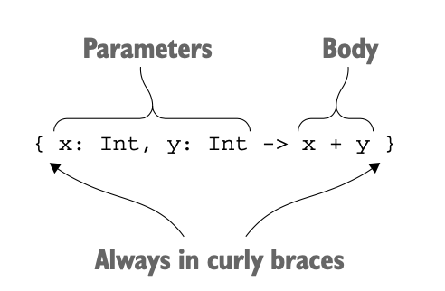

# Chapter 5. 람다로 프로그래밍

> 람다 식(lambda expresssion) or 람다 : 다른 함수에 넘길 수 있는 작은 코드 조각

## 5.1 람다 식의 멤버 참조

### 📌 람다 소개: 코드 블록을 함수 인자로 넘기기

- 일련의 동작을 변수에 저장하거나, 다른 함수에 넘겨야 하는 경우
  - 보통 무명 내부 클래스를 활용하지만, 상당히 번거로움
- 함수형 프로그래밍에서는 함수를 값 처럼 다뤄서 이 문제를 해결한다
  - 함수를 직접 함수에 전달하는 방식!
  - **람다 식을 이용해 함수 선언 없이 코드 블럭을 함수의 인자로 전달**할 수 있다.

### 📌 람다와 컬렉션

- 코드에서 중복을 제거하는 것은 프로그래밍 스타일을 개선하는 중요한 방법
  - 패턴을 제공하는 라이브러리가 많지 않아 자바 개발자는 필요한 컬렉션을 직접 작성해야만 했다.
    - 이 과정에서 코드 양이 많아지면 실수를 저지르기 쉬워진다.
  - 코틀린은 라이브러리 함수를 지원하기에 위 문제를 해결할 수 있다.

```kotlin
data class Person(val name: String, val age: Int)

// 컬렉션 직접 검색하기
fun findTheOldest(people: List<Person>) {
    var maxAge = 0
    var theOldest: Person? = null
    for (person in people) {
        if (person.age > maxAge) { 
            maxAge = person.age
            theOldest = person
        }
    }
    println(theOldest)
}

>>> val people = listOf(Person("Alice", 29), Person("Bob", 31))
>>> findTheOldest(people)
Person(name=Bob, age=31)

// 람다를 사용해 검색하기
>>> var people = listOf(Person("Alice", 29), Person("Bob", 31))
// maxBy는 모든 컬렉션에 대해 호출할 수 있는 함수로, 가장 큰 원소를 찾는다.
>>> println(people.maxBy( it.age ))
Person(name=Bob, age=31)

// 멤버 참조를 이용해 컬렉션 검색하기
>>> println(people.maxBy(Person::age))
Person(name=Bob, age=31)
```

### 📌 람다 식의 문법

> 람다 = 값처럼 여기저기 전달할 수 있는 동작의 모음

- 람다를 따로 선언해서 변수에 저장할 수도 있지만, 보통은 함수에 인자로 넘기면서 바로 람다를 정의한다.

> 기본 람다 식 문법 <br> <br>
> 

- 변수에 람다 식 저장 후 호출하는 방식
  ```kotlin
  >>> val sum = { x: Int, y: Int -> x + y }  
  >>> println(sum(1, 2))
  3  
  ```
- 람다 식을 직접 호출하는 방식 : 읽기 어렵고 쓸모도 없음
  ```kotlin
  >>>  { println(42) }()  
  42  
  ```
- `run`을 이용해 인자로 넘겨받은 람다를 실행하는 방식
  ```kotlin
  >>>  run { println(42) }  
  42  
  ```
  
- 실행 시점에 코틀린 람다 호출은 아무 부가 비용이 들지 않아 성능적 이슈가 없다.
- 람다가 함수의 유일한 인자라면?
  - 괄호 없이 람다 바로 쓰는게 깔끔
- 인자가 여럿 있다면?
  - 람다를 밖으로 빼내거나
  - 람다를 괄호 안에 유지해서 함수의 인자임을 분명히 하거나
  - 둘 이상의 람다를 인자로 받는다면, 맨 마지막 람다만 밖으로 뺴서 함수 호출 구문을 사용할 수 있다.

```kotlin
// 이름 붙인 인자를 이용해 람다 넘기기
>>> val people = listOf(Person("이몽룡", 29), Person("성춘향", 31))
>>> val names = people.joinToString(separator = " ", transform = { p: Person -> p.name })
>>> println(names)  
이몽룡 성춘향

// 함수를 괄호 밖으로 뺀 경우
>>> people.joinToString(" ") {p: Person -> p.name }

// 람다 파라미터 타입 제거하기
>>> people.maxBy { p: Person -> p.age }
>>> people.maxBy { p -> p.age }

// 디폴트 파라미터 이름 it 사용하기
>>> people.maxBy { it.age }
```

- 컴파일러는 람다 파라미터의 타입도 추론할 수 있기에, 파라미터 타입을 명시할 필요가 없다.
- it을 쓰면 코드가 간단해지지만, 람다 안에 람다가 중첩되는 경우 등엔 그냥 람다 파라미터를 명시하는게 좋다.
  - 각각의 it이 가리키는 파라미터가 어떤 람다에 속했는지 파악하기 얼우니까!

```kotlin
>>> val sum = { x: Int, y: Int -> 
...     println("Computing the sum of $x and $y...")
...     x + y 
... }
>>> println(sum(1, 2))
Computing the sum of 1 and 2...
3
```

- 본문이 여러 줄로 이루어진 경우, 제일 마지막 줄이 람다의 결과 값이 된다.

### 📌 현재 영역에 있는 변수에 접근

> 자바 메서드 안에서 무명 내부 클래스를 정의할 때 메서드의 로컬 변수를 무명 내부 클래스에서 사용할 수 있다. <Br>
> 마찬가지로, 함수 안에 정의한 람다는 함수의 파라미터와 로컬 변수를 모두 사용할 수 있다.

```kotlin
// 함수 파라미터를 람다 안에서 사용하는 예시
fun printMessagesWithPrefix(messages: Collection<String>, prefix: String) {  
    messages.forEach {
        println("$prefix $it")
    }  
}
>>> val errors = listOf("403 Forbidden", "404 Not Found")  
>>> printMessagesWithPrefix(errors, "Error:")  
Error: 403 Forbidden
Error: 404 Not Found
```

- 람다가 포획한 변수 (capture) : 람다 안에서 사용하는 외부 변수  
  - 람다 안에서는 final 변수가 아닌 변수에 접근할 수 있다.
  - 람다 안에서 바깥의 변수를 변경할 수 있다.
- 기본적으로 함수 안에 정의된 로컬 변수는 함수가 반환될 때 생명주기가 끝난다.
  - 하지만 어떤 함수가 자신의 로컬 변수를 포획한 람다를 반환하거나 다른 변수에 저장하면 로컬 변수의 생명주기와 함수의 생명주기가 달라질 수 있다.

> 람다는 어떻게 함수가 끝난 후에도 포획한 변수를 읽거나 쓸 수 있을까? <br>
> - final 변수를 포획한 경우 : 람다 코드를 변수 값과 함께 저장한다.
> - final이 아닌 변수를 포획한 경우 : 변수를 특별한 래퍼로 감싸서, 래퍼에 대한 참조를 람다 코드와 함께 저장한다.

### 📌 멤버 참조

- 넘기려는 코드가 이미 함수로 선언된 경우
  - 함수를 호출하는 람다를 만들 수도 있지만, 중복이 생긴다.
  - 이럴때는 함수를 직접 넘기는 `멤버 참조 (::)`를 이용할 수 있다.
    - `{클래스}::{멤버}` 로 사용
    ````kotlin
    >>> val getAge = Person::age
    ````
- 최상위에 선언된 함수나 프로퍼티 참조
  ```kotlin
  fun salute() = println("Salute!")  
  >>> run(::salute)  
  Salute!
  ```
- 인자가 여럿인 다른 함수에게 작업을 위임하는 경우 : 람다를 정의하는 대신, 직접 위임 함수에 대한 참조를 제공하는게 편리
  ```kotlin
  // sendEmail 함수에게 작업을 위임한 람다
  var action = { person: Person, message: String -> 
    sendEmail(person, message)
  }
  // 람다 대신 멤버 참조를 사용했다.
  var nextAction = ::sendEmail
  ```
- 생성자 참조를 이용해 클래스 생성 작업을 연기하거나 저장할 수도 있다.
  - `::` 뒤에 클래스 이름을 넣어 생성자 참조를 만든다.
  ```kotlin
  data class Person(val name: String, val age: Int)  
  >>> val createPerson = ::Person  
  >>> val p = createPerson("Alice", 29)  
  >>> println(p)  
  Person(name="Alice", age=29)
  
  // 확장 함수도 마찬가지로 참조 가능
  fun Person.isAdult() = age >= 21
  var predicate = Person::isAdult
  ```

> 바운드 멤버 참조 <Br>
> : 코틀린 1.1부터 지원하는 문법. <br>
> : 멤버 참조를 생성할 때 클래스 인스턴스를 함께 저장한 다음, 나중에 그 인스턴스에 대해 멤버를 호출한다. <Br>
> : 따라서 호출 시 수신 대상 객체를 별도 지정할 필요가 없다! 
> ```kotlin
> >>> val p = Person("DMITRY", 34)
> >>> val dmitrysAgeFunction = p::age // 바운드 멤버 참조
> >>> println(dmitryAgeFunction())
> 32
> ```

## 5.2 컬렉션 함수형 API

> 컬렉션과 람다를 이용하면 코드를 아주 간결하게 만들 수 있다.

### 📌 필수적인 함수 : filter와 map

> 대부분의 컬렉션 연산을 이 두 함수로 표현할 수 있다.

- filter 
  - 컬렉션에서 원하는 요소를 제거한다.
  ```kotlin
  >> val list = listOf(1, 2, 3, 4)  
  >>> println(list.filter { it % 2 == 0 })
  [ 2, 4 ]
  ```

- map
  - 주어진 람다를 컬렉션의 각 원소에 적용한 결과를 모아서 새 컬렉션을 만든다. (원소 변환)
  ```kotlin
  >> val people = listOf(Person("Alice", 29), Person("Bob", 31)) 
  >>> println(people.map { it.name }) 
  [ Alice, Bob]
  ```

- filter와 map을 동시에 사용하기
  ```kotlin
  >> people.filter { it.age > 30}.map(Person::name)
  [ Bob ]
  ```

- 겉으론 단순해보여도, 내부 로직이 엄청나게 복잡하고 불합리해질 수 잇으니 내가 어떤 코드를 작성하는지 정확히 이해해야 한다.

### 📌 all, any, count, find: 컬렉션에 술어 적용

- 컬렉션의 모든 원소가 어떤 조건을 만족하는지 판단하는 연산들
  - `all, any` : 조건이 모두 만족하는지, 일부만 만족하는지
  - `count` : 조건을 만족하는 원소의 개수 반환
  - `find` : 조건을 만족하는 첫 번째 원소를 반환
- !any = 조건의 부정에 대해 all을 수행한 결과
  - 즉 가독성을 높이기 위해선 any와 all 앞에 !를 붙이지 않는 것이 좋다.

> 함수를 적재적소에 사용하자 : count와 size <br>
> - size를 사용하면 조건을 만족하는 모든 원소가 들어가는 중간 컬렉션이 생긴다.
> - count를 사용하면 원소의 개수만을 추적하기 때문에, 따로 저장할 필요가 없어 효율적이다.

### 📌 groupBy: 리스트를 여러 그룹으로 이뤄진 맵으로 변경

- 컬렉션의 모든 원소를 어떤 특성에 따라 여러 그룹으로 나누고 싶다면?

```kotlin
data class Person(val name: String, val age: Int)
>>> val people = listOf(Person("Alice", 31), Person("Bob", 29), Person("Carol", 31))
// 각 groupBy의 형태는 Map<Int, List<Person>>
>>> println(people.groupBy { it.age })
{ 
  29=[Person(name=Bob, age=29)],
  31=[Person(name=Alice, age=31), Person(name=Carol, age=31)]
}
```

> 멤버 참조를 이용하면 확장 함수도 이용할 수 있다.

### 📌 flatMap과 flatten: 중첩된 컬렉션 안의 원소 처리

- flatMap : 인자로 주어진 람다를 컬렉션 모든 객체에 적용하고, 결과로 얻어지는 여러 리스트를 한 리스트로 모은다.
- flatten : 특별히 변환할 내용이 없다면 리스트 결과를 단순히 펼칠 수도 있다.

```kotlin
class Book(val title: String, val authors: List<String>)
val books = listOf(Book("Thursday Next", listOf("Jasper Fforde")),
        Book("Mort", listOf("Terry Pratchett")),
        Book("Good Omens", listOf("Terry Pratchett", "Neil Gaiman")))
// books 컬렉션에 있는 책을 쓴 모든 저자의 집합
>>> println(books.flatMap { it.authors }.toSet()) 
[ Jasper Fforde, Terry Pratchett, Neil Gaiman ]
```

## 5.3 지연 계산(lazy) 컬렉션 연산

> 큰 컬렉션에서 연산을 인쇄할 때는 시퀀스를 사용하자!

- map, filter 등은 결과 컬렉션을 즉시 (eagerly) 생성한다.
  - 즉, 컬렉션 함수를 print하면 매 단계마다 계산 중간 결과를 새로운 컬렉션에 임시로 담아둔다.
  - 따라서 원본 리스트에 원소가 많으면 많을수록 비효율적!
- `sequence`를 사용해 중간 임시 컬렉션 없이 연산을 수행할 수 있다.
  - `Sequence` 인터페이스에서 시작 : `iterator` 메서드를 이용해 시퀀스로부터 열거될 수 있는 원소 값을 얻는다.
  - 필요할 때가 되어서야 계산되기에, **중간 처리 결과의 저장 없이도 연쇄적인 연산을 이용해 효율적인 처리**가 가능하다.
  - `asSequence` 확장 함수를 이용해 어떤 컬렉션이든 시퀀스로 바꿀 수 있다.

### 📌 시퀀스 연산 실행: 중간 연산과 최종 연산

- 중간 연산 (intermediate) : 최초 시퀀스의 원소를 변환할 수 있는 시퀀스를 반환한다
- 최종 연산 (terminal) : 최초 컬렉션에 대해 변환을 적용한 시퀀스에서 일련의 계산을 적용한 결과를 반환한다. 
  - 컬렉션, 원소, 숫자 또는 객체

```kotlin
// 결과가 필요 없어 최종 연산이 없는 예시
>>> listOf(1, 2, 3, 4).asSequence()  
            .map { print("map($it) "); it * it }  
            .filter { print("filter($it) "); it % 2 == 0 }

// 결과가 필요해서 최종 연산을 호출하여 연기된 모든 계산을 수행하는 예시
>>> listOf(1, 2, 3, 4).asSequence()
        .map { print("map($it) "); it * it }
        .filter { print("filter($it) "); it % 2 == 0 }
        .toList()  
```

- **직접 컬렉션으로 구현했다면?** : 전체 컬렉션 원소에 대해 연산 수행
  - 모든 원소에 대해 Map 수행 -> 이후 모든 원소에 대해 filter 수행
- **시퀀스로 구현했다면?** : 원소를 한 번에 하나씩 처리
  - 첫번째 원소에 대해 map, filter 수행 -> 다음 원소에 대해 map, filter 수행

> 자바 Stream vs 코틀린 Sequence <br>
> : 자바 8버전을 사용한다면 코틀린 컬렉션과 시퀀스에서 제공하지 않는 스트림 병렬 처리 기능을 사용할 수 있다.

### 📌 시퀀스 만들기

- 시퀀스 생성 : `generateSequence`. 이전의 원소를 인자로 받아 다음 원소를 계산한다.
  ```kotlin
      // 시퀀스. 최종 연산 전까지 계산되지 않는다. 여기선 초기값과 ++연산을 정의했다
      val naturalNumbers = generateSequence(0) { it + 1 } 
      // 시퀀스. 최종 연산 전까지 계산되지 않는다. 여기선 <= 100 까지라는 조건을 정의했다
      val numbersTo100 = naturalNumbers.takeWhile { it <= 100 }  
      // 모든 지연 연산은 최종 연산인 "sum" 결과 계산할 때 수행된다.
      println(numbersTo100.sum())
  ```

- 시퀀스 생성2 : 객체의 조상으로 이뤄진 시퀀스 생성
  - 어떤 객체의 조상이 자신과 같은 타입이고, 모든 조상의 시퀀스에서 어떤 특성을 알고 싶은 경우 사용
    ```kotlin
    fun File.isInsideHiddenDirectory() =  
            // 상위 디렉터리 찾기
            generateSequence(this) { it.parentFile }
            // 특성 찾기 :: 여기선 숨김 속성
            .any { it.isHidden } 
    val file = File("/Users/svtk/.HiddenDir/a.txt")
    // .any를 find로 바꾸면 조건은 만족하는 디렉터리를 찾으면 연산을 멈추는 시퀀스가 된다.
    println(file.isInsideHiddenDirectory())  
    ```

## 5.4 자바 함수형 인터페이스 활용

> 코틀린 람다를 자바 API에 활용해보자 <br>
> : 코틀린의 함수 != 자바의 함수형 인터페이스 <br>
> : 코틀린 함수를 쓸 때는 코틀린 컴파일러가 코틀린 람다를 함수형 인터페이스로 변환해주지 않는다.

- `함수형 인터페이스 (functional interface)` 또는 `SAM 인터페이스 (Single Abstract Method interface)`
  - 함수형 인터페이스를 인자로 취하는 자바 메서드를 호출할 때, 무명 클래스 인스턴스 대신 람다를 넘길 수 있다.
  - 따라서 깔끔하고 코틀린다운 코드를 유지할 수 있다!

### 📌 자바 메서드에 람다를 인자로 전달

> 함수형 인터페이스를 인자로 원하는 자바 메서드에 코틀린 람다를 전달할 수 있다.

```java
// Runnable 타입의 파라미터를 받는 자바 메서드
void postponeComputation(int delay, Runnable computation);

// 코틀린 컴파일러가 자동으로 람다를 Runnable 인스턴스로 바꾸어준다.
postponeComputation(1000) { println(42) }
```

- Runnable 인스턴스 = Runnable를 구현한 무명 클래스의 인스턴스
- 람다 vs 무명 객체
  - 객체를 명시적으로 선언한다면 메서드를 호출할 때마다 객체가 새롭게 생성된다.
  - 람다 : 정의가 들어있는 함수의 변수에 접근하지 않는 람다에 대응하는 무명 객체를, 메서드를 호출할 때마다 반복적으로 사용한다.
- 람다가 주변 영역의 변수를 포획한다면 매 호출마다 같은 인스턴스를 사용할 수 없다.
  - 포획 변수 (capture variable) : 람다 안에서 사용하는 외부 변수
  - 이 경우 컴파일러는 매번 주변 영역의 변수를 포획한 새로운 인스턴스를 생성한다.

> 코틀린 1.0에서 인라인 되지 않은 모든 람다식은 무명 클래스로 컴파일된다. <br>
> 코틀린 1.5부터는 코틀린 함수형 인터페이스를 JVM 8 이상의 백엔드 타겟으로 빌드하는 경우, invokedynamic를 사용한 람다로 변환된다. 그리고 LambdaMetafactory.metafactory()를 사용한다

### 📌 SAM 생성자: 람다를 함수형 인터페이스로 명시적으로 변경

> 컴파일러가 람다와 자바 함수형 인터페이스 사이의 변환을 자동으로 처리해주지 못하는 경우

- 함수형 인터페이스의 인스턴스를 반환하는 메서드가 있다면 람다를 직접 반환할 수 없고, SAM 생성자로 감싸야한다.
  ```kotlin
  fun createAllDoneRunnable(): Runnable {  
      // SAM 생성자에 람다를 주입하여 함수형 인터페이스를 구현하는 클래스 인스턴스를 반환
      return Runnable { println("All done!") }
  }
  
  >>> createAllDoneRunnable().run()
  All done!
  ```

- 람다로 생성한 함수형 인터페이스 인스턴스를 변수에 저장해야 하는 경우에도 SAM 생성자를 사용할 수 있다.
  ```kotlin
  val listener = OnClickListener { view -> 
      val text = when (view.id) {
          R.id.button1 = "First button"
          R.id.button2 = "Second button"
          else -> "UnKnown button"
      }
      toast(text)
  }
  // 어떤 버튼이 클릭되었는지에 따라 적절한 동작을 수행한다.
  button1.setOnClickListener(listener)
  button2.setOnClickListener(listener)
  ```

> 람다와 리스터 등록 / 해제 <br>
> : 람다는 무명 객체와 달리 this가 없다. 따라서 무명 클래스 인스턴스를 참조할 방법이 없다. <br>
> : 따라서 람다 안에서 this는 그 람다를 둘러싼 클래스의 인스턴스를 가리킨다. <br>
> : 만약 리스터 등록을 해제해야 하는 경우가 있다면 무명 객체를 사용해 리스터를 구현하자.

- 함수형 인터페이스를 요구하는 메서드를 호출할 때, 오버로드한 메서드 중 어떤 타입의 메서드를 선택해 람다를 변환할지 모호한 경우에도 사용할 수 있다.
  - 명시적으로 SAM 생성자를 적용하여 컴파일 오류를 피할 수 있다.

## 5.5 수신 객체 지정 람다 : with와 apply

> 자바 람다에는 없는 코틀린 람다의 고유 기능 <br>
> : 수신 객체 명시하지 않고, 람다의 본문 안에서 다른 객체의 메서드를 호출할 수 있게 하는 것 = 수신 객체 지정 람다

### 📌 with 함수

> 어떤 객체의 이름을 반복하지 않고도 해당 객체에 대해 다양한 연산을 수행할 수 있게 만드는 라이브러리 함수

```kotlin
// 일반적인 알파벳 생성 코드. result를 매번 반복 사용해야 한다.
fun alphabet(): String {  
    val result = StringBuilder() 
    for (letter in 'A'..'Z') {  
         result.append(letter)
    }    
    result.append("\nNow I know the alphabet!")  
    return result.toString()
}  
  
>>> println(alphabet())  
ABCDEFGHIJKLMNOPQRSTUVWXYZ
Not I know the alphabet!
        
// with을 이용한 알파벳 생성 코드
fun alphabet(): String {
  val stringBuilder = StringBuilder()
  // 메서드를 호출하려는 수신 객체를 지정
  return with(stringBuilder) { 
    for (letter in 'A'..'Z') {
      // this를 명시하여 수신 객체의 메서드를 호출
      this.append(letter) 
    }
    // this 생략하고 메서드 호출 가능
    append("\nNow I know the alphabet!")
    // 람다에서 값 반환
    this.toString()
  }
}

>>> println(alphabet()) 
```

- `with 함수` : 첫 번째 인자로 받은 객체를 두 번째 인자로 받은 람다의 수신 객체로 만든다.
  - 인자로 받은 람다 본문에서는 this를 이용해 수신 객체에 접근할 수 있다.
  - 프로퍼티나 메서드 이름만으로도 수신 객체 멤버에 접근할 수 있다.

> 수신 객체 지정 람다 vs 확장 함수 <br>
> : 확장 함수 안에서 this = 함수가 확장하는 타입의 인스턴스 <br>
> : 수신 객체 this의 멤버를 호출할 땐 this.를 생략 가능. 따라서 아래 관계 유추 가능 <br>
> - 일반 함수 ~ 일반 람다
> - 확장 함수 ~ 수신 객체 지정 람다

- 식을 본문으로 하는 함수를 이용, 불필요한 stringBuilder 변수를 없애고 식의 결과를 바로 반환할 수 있다.
  ```kotlin
  // with와 식을 본문으로 하는 함수를 이용해 알파벳 만들기
  fun alphabet(): with(StringBuilder()){
      for (letter in 'A'..'Z') {
        append(letter) 
      }
      append("\nNow I know the alphabet!")
      toString()
  }
  ```

> 메서드 이름 충돌 <br>
> : with에게 인자로 넘긴 객체의 클래스와 with를 사용하는 코드가 들어있는 클래스 안에 이름이 같은 메서드가 있다면? <br>
> : this 참조 앞에 레이블을 붙여 호출하고 싶은 메서드를 명시할 수 있다. <br>
> : ex. this@OuterClass.toString()

### 📌 apply 함수

> 람다의 결과 대신 수신 객체가 필요한 경우 사용한다.

- with과 동일하지만, apply는 항상 자신에게 전달된 객체 (= 수신 객체)를 반환한다는 점에서 차이를 갖는다.

```kotlin
fun alphabet() = StringBuilder().apply {  
    for (letter in 'A'..'Z') {  
        append(letter)  
    }    
  append("\nNow I know the alphabet!")  
}.toString()
```

- 객체의 인스턴스를 만들면서, 즉시 프로퍼티 중 일부를 초기화해야 하는 경우 유용하다.
  - Java는 별도의 Builder 객체를 이용해 구현하지만, 코틀린은 그냥 apply를 쓰면 된다.
- 더 구체적인 함수를 이용해 코드를 단순화할 수 있다.

```kotlin
// buildString을 활용해 리팩토링
fun alphabet() = buildString {
          for (letter in 'A'..'Z') {
            append(letter)
          }    
          append("\nNow I know the alphabet!")
        }
```